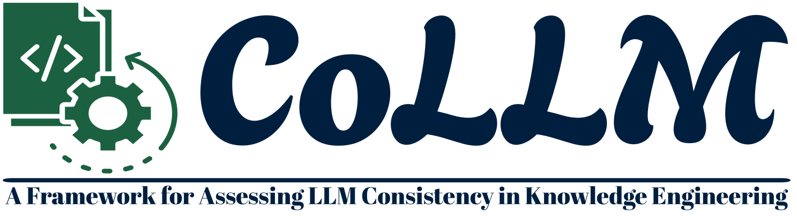
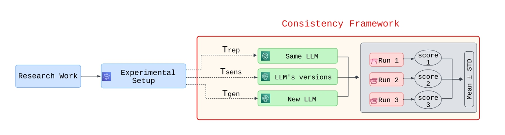

<div align="center">
 
 <H1>CoLLM: Consistency of Large Language Models in Knowledge Engineering</H1>

[](https://github.com/pre-commit/pre-commit)
[](https://github.com/psf/black)
[](https://pycqa.github.io/isort/)

</div>

**Consistency** is a critical concern in knowledge engineering (KE), particularly given the increasing reliance on Large Language Models (LLMs) in various tasks. This work introduces a framework to assess the Consistency of Large Language Models when used to support KE (as depicted the following figure).



The CoLLM, is designed to assess whether a system or process produces consistent results in LLM-based KE tasks through three tests:

1. **Reproducibility Test**, which evaluates the extent of randomness in existing studies
1. **Sensitivity Test**, which examines the effect of LLM updates on results.
2. **Generalizability Test**, which explores the feasibility of using alternative LLMs to perform the same study.

These tests empirically validate the consistency of the results in KE studies under varying conditions to ensure the reliability of the reported findings of research efforts. The framework is validated by means of extensive experimentation using five recent research papers to define the research work, and leveraging various LLMs and datasets.

## Directories
- `case-studies`: you need to create your case-study-specific directory here (if it is not there already). Please organize your code to be executable via the same directory as a root.
- `images`: directory contains any general images/diagrams related to the project. e.g. architecture diagram.

## Research Works
The case studies of this work are as follows:

|   | Title                                                      |                         Directory                         |
|:-:|:-----------------------------------------------------------|:---------------------------------------------------------:|
| 1 | Navigating Ontology Development with Large Language Models | [OntologyDevelopement](case-studies/OntologyDevelopment/) |
| 2 | Ontology generation with metacognitive prompting and LLMs  |           [Ontogenia](case-studies/Ontogenia/)            |
|3 | LLMs4OL: Large Language Models for Ontology Learning       |              [LLMs4OL](case-studies/LLMs4OL)              |
|4| LLMs4OM: Maching Ontologies with Large Language Models|              [LLMs4OM](case-studies/LLMs4OM)              |
|5|  Retrofitting CQs from Existing Ontologies Using LLMs      |                     [RETROFIT-CQs](case-studies/RETROFIT-CQ)                      |

[//]: # ()
[//]: # (## Contributors Guidelines)

[//]: # (*Feel free to skip step 2 if it is inconvenient for you to use pre-commit, once you are done and request for merge, I will take care of fixing the pre-commit related issues -- it is not a big deal at the moment*)

[//]: # ()
[//]: # (1. Clone the repository to your local machine:)

[//]: # (```bash)

[//]: # ( git clone git@github.com:XXX/CoLLM.git)

[//]: # ( cd REPRO)

[//]: # (```)

[//]: # ()
[//]: # (2. Create a virtual environment with `python=3.9` &#40;or any python distribution&#41;, activate it, install the required)

[//]: # (   dependencies and **install the pre-commit configuration:**)

[//]: # ()
[//]: # (```bash)

[//]: # (conda create -n my_env python=3.9)

[//]: # (conda activate my_env)

[//]: # (pip install -r requirements.txt)

[//]: # (pre-commit install)

[//]: # (```)

[//]: # ()
[//]: # (3. Create a branch and commit your changes:)

[//]: # (```bash)

[//]: # (git switch -c <name-your-branch>)

[//]: # (# do your changes)

[//]: # (git add .)

[//]: # (git commit -m "your commit msg")

[//]: # (git push)

[//]: # (```)

[//]: # ()
[//]: # (4. Once you finished your work, please make a merge request to `main` for review. We will check for any minor issue that code may cause - such removal of secret keys, missing files and ...)


# License
<p>
  This software is licensed under the
  <a href="https://opensource.org/licenses/MIT" target="_blank">MIT License</a>.
</p>
<a href="https://opensource.org/licenses/MIT" target="_blank">
  
</a
