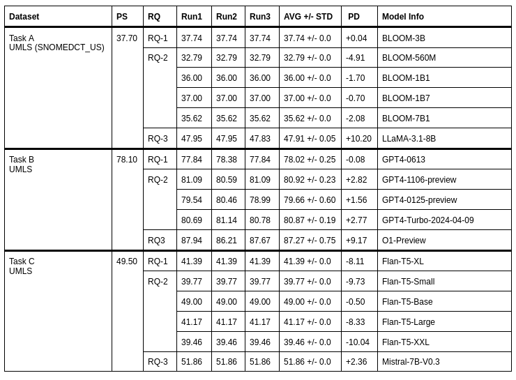

## Case Study 2 on Ontology Learning  -- `Large Language Models for Ontology Learning (LLMs4OL) Paradigm`
This case study examines the application of the **REPRO** framework to existing ontology learning research within the field of knowledge engineering. Specifically, we explore the **LLMs4OL** paradigm, which assesses the capabilities of large language models (LLMs) for ontology learning through study of researchers titled **LLMs4OL: Large Language Models for Ontology Learning**.

### Results Table
The results of our experiments are summarized in the table below:



### How to Run the Experiments

1. Rename `.env-example` file to `.env` and add your API keys: `OPENAI_KEY=` for OpenAI models and `HUGGINGFACE_ACCESS_TOKEN` for models that require Hugging Face access.
2. All runs are automated, so to run the experiments, execute the following scripts:
   * **Task A**: Run `task_a_runner.sh`
   * **Task B**: Run `task_b_runner.sh`
   * **Task C**: Run `task_c_runner.sh`

**Note**: We only considered biomedicine dataset of the LLMs4OL study.

## Reference
```bibtex
@InProceedings{10.1007/978-3-031-47240-4_22,
        author="Babaei Giglou, Hamed
        and D'Souza, Jennifer
        and Auer, S{\"o}ren",
        editor="Payne, Terry R.
        and Presutti, Valentina
        and Qi, Guilin
        and Poveda-Villal{\'o}n, Mar{\'i}a
        and Stoilos, Giorgos
        and Hollink, Laura
        and Kaoudi, Zoi
        and Cheng, Gong
        and Li, Juanzi",
        title="LLMs4OL: Large Language Models for Ontology Learning",
        booktitle="The Semantic Web -- ISWC 2023",
        year="2023",
        publisher="Springer Nature Switzerland",
        address="Cham",
        pages="408--427",
        isbn="978-3-031-47240-4"
}
```
