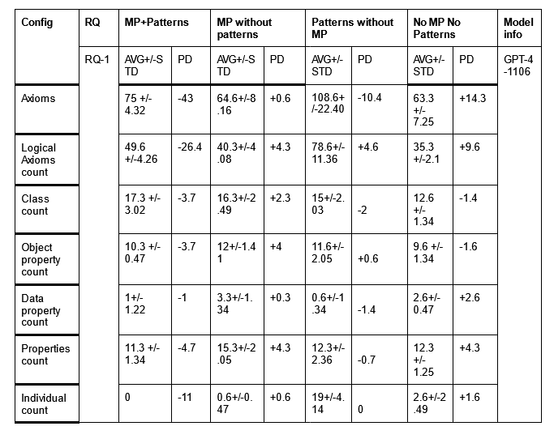
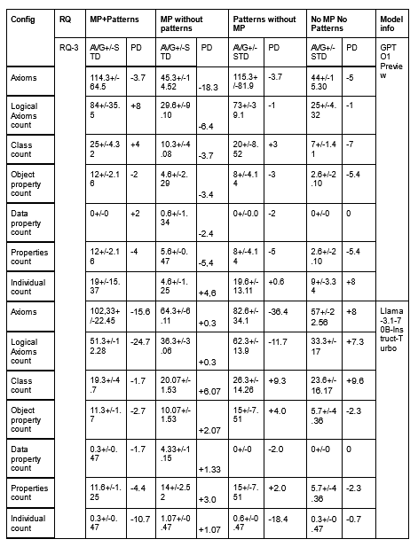

# Case Study 2 on Ontology Generation -- `Ontology generation with metacognitive prompting and LLMs`

For ontology generation, Ontogenia, employs a gold-standard dataset of ontology competency questions translated into SPARQL-OWL queries.

### Results Table
The results of our experiments are summarized in the table below:

<div align="center">



</div>

## How to Run the Experiments for CoLLM?

Run `code/ontogenia-process.py` script using the dataset that is available at `data/` to obtain the outputs. The result of this experimentation is available in the `resulting-ontologies/` directory.


## Reference
```bibtex
@inproceedings{lippolis2024ontogenia,
  title={Ontogenia: Ontology generation with metacognitive prompting in large language models},
  author={Lippolis, Anna Sofia and Ceriani, Miguel and Zuppiroli, Sara and Nuzzolese, Andrea Giovanni},
  booktitle={Proc. of the Extended Semantic Web Conference-Satellite Events, Springer, Crete, Grece},
  year={2024}
}
```
