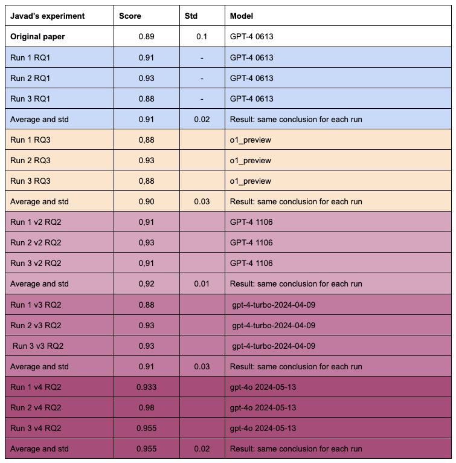

The main code and instructions for reproducing this case study are presented here: [LLMs4OntologyDev](https://github.com/LiUSemWeb/LLMs4OntologyDev-ESWC2024)

The outputs of the experiment are divided into three folders based on each research question (RQ).

## The core code behind the CQbyCQ method is 

```Python
import time
def cqbycq(S,CQs,runNumber,story):
  cq_number = 1
  file_name = story+' run'+str(runNumber)+' RQ3 O1'
  f = open(file_name+'.ttl','w+')
  Memory = ""
  for cq in CQs:
    print("We are processing CQ number: ",CQs.index(cq)+1)
    prompt = cqbycq_prompt.format(Story=S+'\n'.join(CQs),\
                                  CQ=cq,rdf='\n'+Memory)
    output = chat_with_gpt(prompt);time.sleep(75);
    if cq_number in [1,15]:
      print('Length of the prompt: ',len(prompt))
      print('Length of the respond: ',len(output))
    Memory += output + '\n\n#############################\n'
    cq_number += 1
  f.write(Memory)
  f.close()
```
The prompt is in [the main repository- CQbyCQ](https://github.com/LiUSemWeb/LLMs4OntologyDev-ESWC2024/blob/main/Prompts/CQbyCQ.md) 
<p align="center">


</p>

## The detailed results of the experiment for each run
### Reproducibility of Case Study 1 
In Table [ref], under the row ``Reproducibility Test,'' the obtained results indicate a +2.37\% performance drift compared to the original work, leading to the same conclusion. Additionally, the standard deviation (STD) in the original work (10) was reported to be higher than in the replicated results.

### Sensitivity of Case Study 1 
By looking at the table there are 4 different versions of GPT-4  we can observe that updates to GPT-4 do not fail in the reproducibility of the case study. Also, there is no trend of increase or decrease for the score meaning the updates of GPT-4 have no predictable effect on the performance.

### Generalizability of Case Study 1 
Although this case study is not dependent on GPT-4, a newer OpenAI model with enhanced reasoning capabilities, o1-preview did not achieve a better score than other models in this case study; instead, it obtained the minimum score and exhibited the highest standard deviation.


<div align="center">
  


</div>
