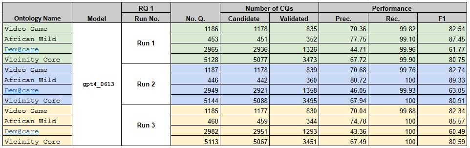
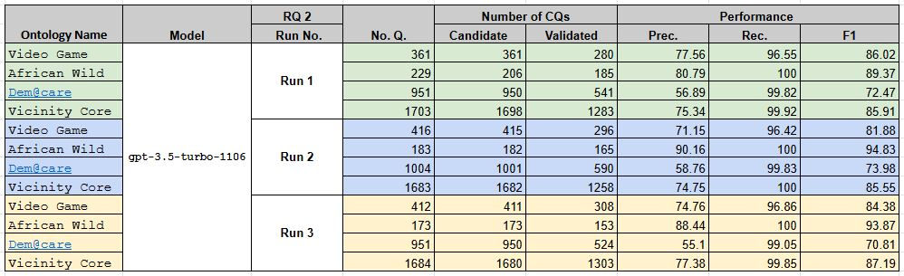
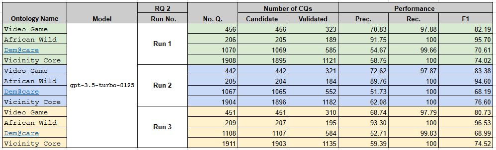
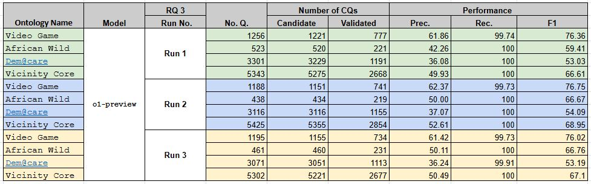

# Case Study 5 on RETROFIT-CQs -- Retrofitting CQs from Existing Ontologies Using LLMs

This case study examines the application of the **REPRO** framework to **RETROFIT CQs** within the field of knowledge engineering. Specifically, it explores **RETROFIT CQs**, leveraging the capabilities of large language models (LLMs) to retrofit competency questions (CQs) from existing ontologies. This study is based on the work of researchers, titled **An Experiment in Retrofitting Competency Questions for Existing Ontologies**.

## Results Table

The results of our experiments are summarized in the table below:







## How to Run the Experiments

1. Run the experiment scripts in [experiment_scripts](https://github.com/SemTech23/RETROFIT-CQs/tree/main/Implementation).
2. The dataset for this case study is available in [dataset](https://github.com/SemTech23/RETROFIT-CQs/tree/main/Data/Ontologies). 
3. Add the model’s name (LLMs) and API key.
4. Use the evaluation scripts provided in [evaluation_scripts](https://github.com/SemTech23/RETROFIT-CQs/tree/main/Evaluation).


## Reference
```bibtex
@inproceedings{10.1145/3605098.3636053,
author = {Alharbi, Reham and Tamma, Valentina and Grasso, Floriana and Payne, Terry},
title = {An Experiment in Retrofitting Competency Questions for Existing Ontologies},
year = {2024},
isbn = {9798400702433},
publisher = {Association for Computing Machinery},
address = {New York, NY, USA},
url = {https://doi.org/10.1145/3605098.3636053},
doi = {10.1145/3605098.3636053},
booktitle = {Proceedings of the 39th ACM/SIGAPP Symposium on Applied Computing},
pages = {1650–1658},
numpages = {9},
location = {Avila, Spain},
series = {SAC '24}
}

```
