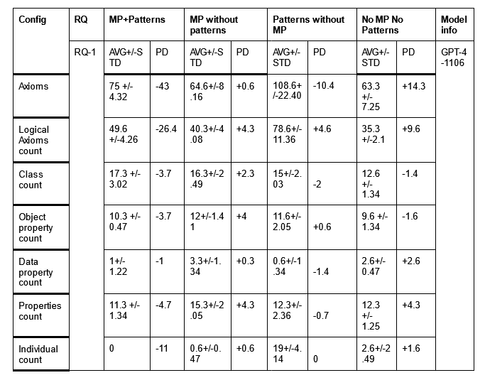
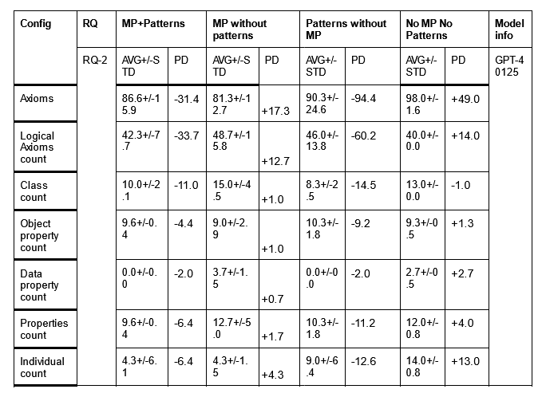

<<<<<<< Updated upstream
# Case Study 1.1 on Ontology Generation -- `Ontology generation with metacognitive prompting and LLMs`

This case study examines t...through a different study of researchers titled **title**.


### Results Table
The results of our experiments are summarized in the table below:





## How to Run the Experiments for REPRO?

1.
2.
3.


Datasets for this case study are available in the .

## Reference
```bibtex

```
=======
# REPRO
>>>>>>> Stashed changes
